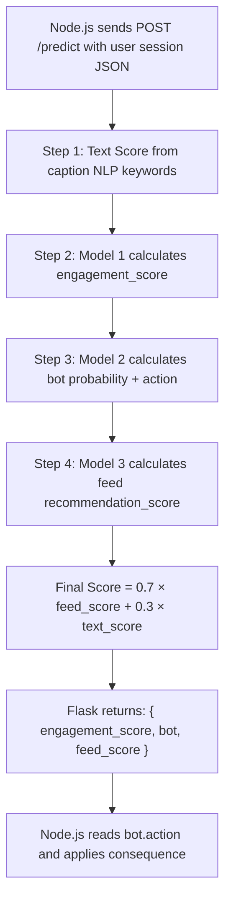
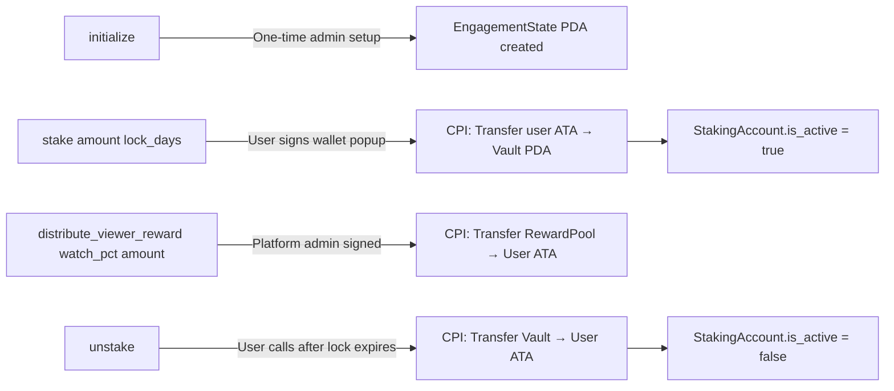
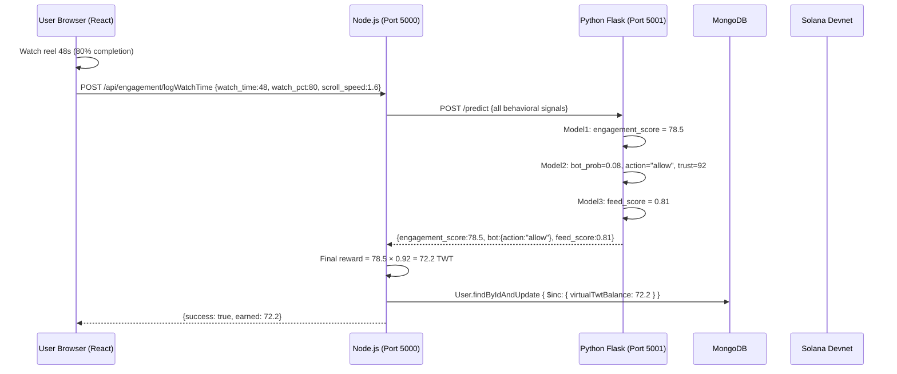
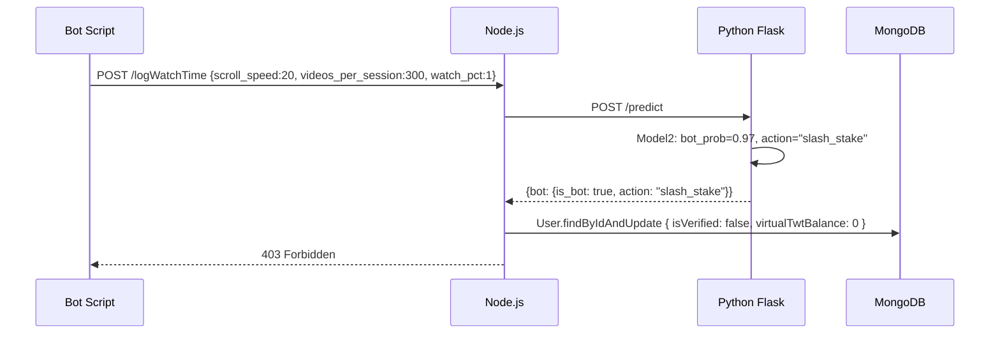
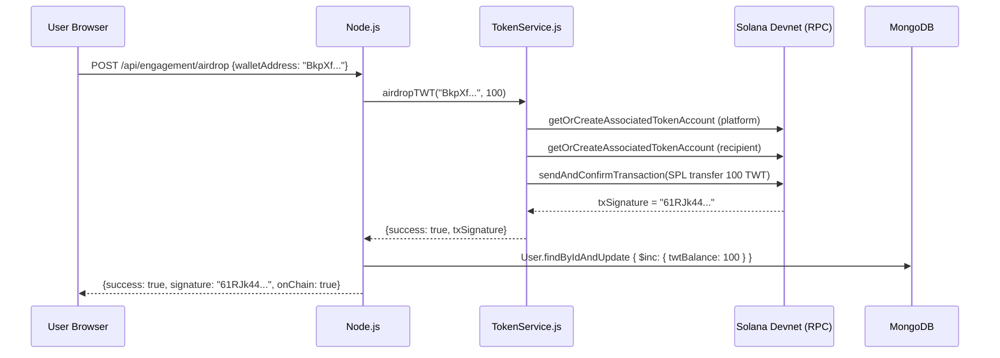
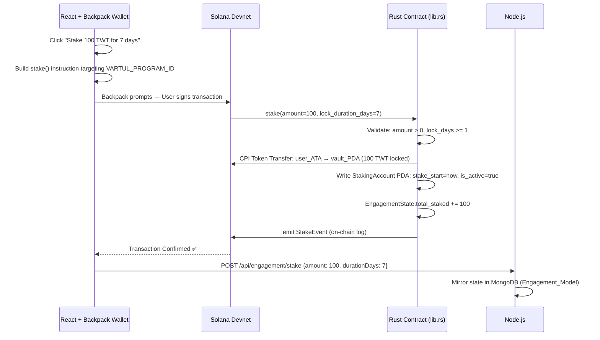

# VarTul Platform — Definitive Architecture Document
**Complete file-by-file technical breakdown: MERN + ML + Solana Web3**

---

## 📂 Project File Structure

```
VarTul/
├── Frontend/                   # React 19 + Vite SPA
│   └── src/
│       ├── App.jsx             # Root router & layout orchestrator
│       ├── main.jsx            # React entry point, WalletProvider wrapping
│       ├── Pages/              # Full page components
│       │   ├── Home.jsx        # Main social feed
│       │   ├── Reels.jsx       # Short-form video (Watch-to-Earn source)
│       │   ├── Chat.jsx        # Real-time messaging UI
│       │   ├── About.jsx       # Project about page
│       │   ├── Twt_Token.jsx   # TWT token overview page
│       │   └── dashboard/      # Web3 creator dashboard
│       │       ├── Overview.jsx
│       │       ├── WalletPage.jsx     # Airdrop & claim UI
│       │       ├── StakingPage.jsx    # Stake TWT UI
│       │       ├── RewardsPage.jsx
│       │       └── TransactionsPage.jsx
│       ├── Components/         # Reusable UI components
│       ├── Context/            # React Context (auth, socket)
│       ├── Utils/
│       │   ├── axiosInstance.js     # Axios with JWT headers
│       │   └── SocketContext.jsx    # WebSocket management
│       └── store/              # Redux global state
│
├── Backend/                    # Node.js + Express API
│   ├── Server.js               # Entry point: Express + Socket.io + Redis setup
│   ├── Controllers/
│   │   ├── EngagementController.js  # Core TWT/staking logic (948 lines)
│   │   ├── Reelcontroller.js        # Reel CRUD + view tracking
│   │   ├── Usercontroller.js        # Auth, profile, wallet linking
│   │   ├── Messagecontroller.js     # Chat message handling
│   │   └── GovernanceController.js  # DAO voting logic
│   ├── Blockchain/
│   │   ├── TokenService.js     # SPL token transfers via @solana/web3.js
│   │   └── EngagementContract.js  # Anchor contract interaction wrapper
│   ├── Models/                 # Mongoose Schemas
│   │   ├── User.js             # User + wallet + TWT balance schema
│   │   ├── Engagement_Model.js # Staking state schema
│   │   ├── TransactionLog.js   # All TWT tx history
│   │   ├── Reel_Model.js
│   │   └── ... (14 total schemas)
│   ├── routes/
│   │   ├── EngagementRoute.js  # /api/engagement/*
│   │   ├── MlRoute.js          # /api/ml/*  (Node→Python bridge)
│   │   └── ... (8 total route files)
│   └── Config/
│       ├── db.js               # MongoDB connection
│       └── redis.js            # Redis client
│
├── Vartul_ML/                  # Python Flask ML Microservice
│   ├── ml_api.py               # Flask server on port 5001 (ALL endpoints)
│   ├── Run_all.py              # Training pipeline runner
│   ├── model1_engagement.py    # Random Forest Regressor training
│   ├── model2_bot_detection.py # Random Forest + Isolation Forest + LR
│   ├── model3_feed_ranking.py  # Gradient Boosting Regressor
│   ├── utils.py                # load_data(), BOT_THRESHOLD, DATA_PATH
│   ├── model1.pkl              # 9.9 MB - trained engagement model
│   ├── model2.pkl              # 287 KB - trained bot detection model
│   ├── model3.pkl              # 581 KB - trained feed ranking model
│   └── 1773666452049_vartul_dataset_syn.xlsx  # 2.2 MB training dataset
│
└── SmartContracts/
    └── vartul_engagement/
        └── src/lib.rs          # Anchor/Rust smart contract (310 lines)
```

---

## 🌐 Layer 1: The MERN Web2 Stack

### `Backend/Server.js` — The Traffic Cop

This is the Node.js entry point. It wires everything together:

```
Express App
  │
  ├── cors({ origin: "http://localhost:5173" })     ← React frontend only
  ├── await connectDb()                             ← MongoDB connection
  ├── await redisClient.connect()                  ← Redis cache
  ├── Socket.io server on same HTTP port           ← Real-time WS
  │
  └── Routes mounted:
       /api/auth         → UserRoute.js
       /api/messages     → Chatroute.js
       /api/post         → PostRoute.js
       /api/story        → Stroyrouter.js
       /api/reels        → Reelrouter.js
       /api/engagement   → EngagementRoute.js   ⬅ TWT/Staking
       /api/governance   → GovernanceRoute.js   ⬅ DAO
       /api/ml           → MlRoute.js           ⬅ Python bridge
```

### `Backend/Models/User.js` — The Master Schema

Every user document stored in MongoDB has these critical Web3 fields:

| Field | Type | Purpose |
| :--- | :--- | :--- |
| `walletAddress` | String | Linked Backpack/Phantom public key |
| `twtBalance` | Number | Real claimable TWT (source of truth) |
| `virtualTwtBalance` | Number | Pre-chain earnings from watch sessions |
| `tokensStaked` | Number | Currently locked in smart contract |
| `totalRewardsEarned` | Number | Lifetime rewards accumulated |
| `ivtgClaimed` | Boolean | Initial Virtual Token Grant taken? |
| `isVerified` | Boolean | Human verified by ML |

### `Backend/Models/Engagement_Model.js` — Staking State

One record per user tracking their on-chain stake status:

```js
{
  user: ObjectId → User,
  stakeAmount: Number,          // TWT locked
  stakeStartTime: Date,         // When they staked
  lockDurationDays: Number,     // 1, 7, 30...
  accumulatedWatchTimeMs: Number, // Watch time earned this epoch
  status: "active" | "inactive" | "locked",
  totalRewardsEarned: Number
}
```

### Socket.io Real-Time Events (`Server.js` lines 65-140)

```
User connects → UserSocketMap[userId] = socket.id
User sends message:
  socket.emit("sendMessage") →
    Server looks up receiverSocketId →
      io.to(receiverSocketId).emit("newMessage")

Typing:
  socket.emit("typing") → io.to(receiverSocketId).emit("userTyping")

Online users:
  io.emit("getOnlineUsers", Object.keys(UserSocketMap))
```

---

## 🤖 Layer 2: The Machine Learning Pipeline

This is the most sophisticated architectural layer. Here is the **complete real data flow** based on reading the actual source code.

### The Training Dataset
`1773666452049_vartul_dataset_syn.xlsx` — A synthetic behavioral dataset (2.2 MB) containing thousands of simulated user sessions with columns for every signal below. This is loaded by `utils.load_data()` using `pandas`.

### The 3 Models — Exact Specifications

---

#### **Model 1: Engagement Score** (`model1_engagement.py` → `model1.pkl` 9.9 MB)

**Algorithm:** `RandomForestRegressor(n_estimators=100, max_depth=12, min_samples_leaf=5)`

**Input Features:**
| Feature | What it measures |
| :--- | :--- |
| `watch_time` | Seconds the reel was watched |
| `watch_percentage` | % of video completed |
| `likes` | Likes given this session |
| `shares` | Share actions |
| `comments` | Comments left |
| `save_video` | 0/1 — saved to collection |
| `views` | Total views on post |
| `replay_count` | Times rewound |
| `video_length` | Duration of the video |
| `is_viral_video` | 0/1 flag |

**Output:** `engagement_score` — continuous float (0 → ~162). Higher means more genuine human engagement.

**Then used as:** Input into Model 3's `engagement_score` feature.

---

#### **Model 2: Bot Detection** (`model2_bot_detection.py` → `model2.pkl` 287 KB)

**Algorithms compared:**
1. `RandomForestClassifier(n_estimators=100, max_depth=10, class_weight="balanced")` ← **Primary (best)**
2. `IsolationForest(n_estimators=100, contamination=bot_ratio)` ← Unsupervised backup
3. `LogisticRegression(class_weight="balanced")` ← Baseline

**Input Features (behavioral signals ONLY — no pre-calculated scores):**
| Feature | Bot Signal |
| :--- | :--- |
| `scroll_speed` | Bots scroll 10–20x/sec. Humans: 1–3x/sec |
| `skip_time` | Bots skip immediately (0–1s). Humans: 5–15s |
| `watch_percentage` | Bots watch 1–5%. Humans: 60–90% |
| `session_duration` | Bots: 5–30s sessions. Humans: 5–30 minutes |
| `videos_per_session` | Bots: 100–300. Humans: 3–10 |
| `watch_time` | Bots: 1–2s. Humans: 30–60s |
| `likes` | Bots mass-like (50–200). Humans: 0–5 |
| `shares` | Bots mass-share |
| `stake_amount` | Bots rarely stake TWT |
| `device_type` | 0/1 encoded (mobile/desktop) |
| `network_type` | 0/1 encoded |

**Output (exact from code):**
```python
{
  "is_bot": True / False,
  "bot_probability": 0.0 – 1.0,
  "trust_score": 0 – 100,       # = (1 - bot_prob) * 100
  "action": "allow" | "remove_rewards" | "slash_stake"
}
```

**Action Thresholds:**
```
bot_probability >= 0.70  → "slash_stake"      (cut staking rewards immediately)
bot_probability >= 0.40  → "remove_rewards"   (halt TWT earnings)
bot_probability < 0.40   → "allow"            (normal user, credit rewards)
```

---

#### **Model 3: Feed Ranking + Reward Distribution** (`model3_feed_ranking.py` → `model3.pkl` 581 KB)

**Algorithm:** `GradientBoostingRegressor(n_estimators=150, learning_rate=0.05, max_depth=5)`

**Input Features:**
| Feature | Purpose |
| :--- | :--- |
| `engagement_score` | Output FROM Model 1 (pipeline chaining!) |
| `creator_reputation` | Creator's historical quality score (0–1) |
| `creator_followers` | Follower count |
| `stake_amount` | How much TWT the creator staked |
| `is_viral_video` | 0/1 |
| `watch_percentage` | Watch completion |
| `replay_count` | Rewatches |
| `save_video` | Saved to collection |
| `video_category` | Encoded category |
| `follow_creator` | Does viewer follow creator? |
| `viewer_reward` | TWT rewarded to viewer |
| `video_length` | Duration |
| `views` | Total views |

**Output:** `recommendation_score` 0.0 → 1.0 — determines where this reel appears in your feed.

**Reward Pool Distribution (epoch-based):**
```
Total epoch pool (e.g. 10,000 TWT) splits:
  40% → Creators   (proportional to their total engagement_score share)
  40% → Viewers    (proportional to their watch contribution_score)
  20% → Treasury   (platform reserve for liquidity)
```

---

### The Flask API (`ml_api.py`) — The Single Entry Point

All 3 models are **preloaded at Flask startup** (avoids 500ms cold loading per request):

```python
_model1 = pickle.load("model1.pkl")   # Engagement (Random Forest Regressor)
_model2 = pickle.load("model2.pkl")   # Bot Detection (RF + scaler)
_model3 = pickle.load("model3.pkl")   # Feed Ranking (Gradient Boosting)
```

**The single `POST /predict` endpoint runs ALL 3 in sequence:**



**Final Reward Formula** (from `Run_all.py` line 126):
```
Final TWT Reward = engagement_score × (trust_score / 100)
```

So a user with `engagement_score=85` and `trust_score=92` earns `85 × 0.92 = 78.2 TWT`.
A bot with `trust_score=5` earns `85 × 0.05 = 4.25 TWT` → soon zeroed out.

### Node.js ↔ Python Communication

Located in `Backend/routes/MlRoute.js` and called from `EngagementController.js`:

```js
// Node.js calls Python Flask at:
POST http://localhost:5001/predict
Content-Type: application/json
Body: {
  watch_time, watch_percentage, likes, shares, comments,
  scroll_speed, skip_time, session_duration, videos_per_session,
  stake_amount, creator_reputation, creator_followers, views, caption
}

// Response:
{
  engagement_score: 78.5,
  bot: {
    is_bot: false,
    bot_probability: 0.08,
    trust_score: 92.0,
    action: "allow"
  },
  feed_score: 0.812
}
```

---

## ⛓️ Layer 3: Solana Web3 Blockchain

### `Backend/Blockchain/TokenService.js` — The SPL Oracle

This Node.js module is the bridge between the Express API and the Solana blockchain. It uses `@solana/web3.js` and `@solana/spl-token`.

**How the Airdrop works (exact code flow):**

```
1. Load PLATFORM_PRIVATE_KEY from .env (byte array)
   → Keypair.fromSecretKey(Uint8Array.from(keyArray))
   Platform wallet: dadLVDC7VmD7SZU5iaxzmZkxE8HCYTQLtVY1uaPL9sm

2. Create RPC Connection to Devnet:
   new Connection("https://api.devnet.solana.com", "confirmed")

3. Get/create Platform's Associated Token Account (ATA) for TWT mint

4. Get/create Recipient's ATA (created if first time, platform pays fee)

5. Build SPL Transfer instruction:
   createTransferCheckedInstruction(
     platformATA,           // from
     mintPubKey,            // TWT mint address
     recipientATA,          // to
     platformKeypair,       // authority signer
     rawAmount,             // amount × 10^decimals (6 decimals)
     TOKEN_DECIMALS
   )

6. sendAndConfirmTransaction(conn, tx, [platformKeypair])
   → Returns txSignature on-chain
```

**Functions exposed:**
| Function | What it does |
| :--- | :--- |
| `airdropTWT(wallet, amount)` | Platform → User SPL transfer |
| `getTwtBalance(wallet)` | Read user's on-chain TWT balance |
| `getSolBalance(wallet)` | Read SOL balance for fee checking |
| `getMintInfo()` | Fetch TWT mint supply, decimals |
| `getWalletTransactions(wallet, limit)` | Fetch signature history |
| `verifyTransaction(txSignature)` | Confirm tx finalized |
| `getNetworkInfo()` | Network health, version, current slot |

### `SmartContracts/vartul_engagement/src/lib.rs` — The Rust Contract

**Program ID:** `AehNZSfNSq39vffKLvWouJEhuJgvPmHh6qMNB2LgpNue`

**The 3 PDA Accounts used:**
```
SEED_STATE   = b"engagement_state"  → EngagementState (global platform totals)
SEED_STAKING = b"staking"           → StakingAccount per user (per-wallet state)
SEED_VAULT   = b"vault"             → TokenAccount holding all locked TWT
```

**The 4 Instructions:**



**Stake Instruction Detail (lib.rs lines 49-88):**
```rust
pub fn stake(ctx: Context<Stake>, amount: u64, lock_duration_days: u64) -> Result<()> {
    // 1. Validate amount > 0, lock_days >= 1
    // 2. CPI to Solana Token Program:
    //    Transfer { from: user_token_account, to: vault, authority: user }
    // 3. Write to StakingAccount PDA:
    //    amount, lock_duration_days, stake_start = Clock::get().unix_timestamp
    // 4. Increment EngagementState.total_staked
    // 5. emit!(StakeEvent{...}) — on-chain event log
}
```

**Unstake Guard (lib.rs lines 148-151):**
```rust
let lock_seconds = (staking_account.lock_duration_days as i64) * 86400;
let unlock_time = staking_account.stake_start + lock_seconds;
require!(now >= unlock_time, VartulError::StillLocked);
// Cannot withdraw even 1 second early — enforced by blockchain
```

**Reward Distribution Requirement (lib.rs line 101):**
```rust
require!(watch_percentage >= 60, VartulError::InsufficientWatchTime);
// Must watch at least 60% of a reel to qualify for on-chain reward
```

---

## 🔄 Complete End-to-End Workflow

### Flow 1: Watch-to-Earn (Most Common)



### Flow 2: Bot Detected



### Flow 3: Claim Airdrop (Virtual → Real On-Chain)



### Flow 4: Stake Tokens (On-Chain Locking)



---

## 📊 Data Flow Summary

```
REACT (Port 5173)
  ↓ axios + JWT header
NODE.JS (Port 5000)
  ↓ HTTP POST
PYTHON FLASK (Port 5001)      ← ML predictions
  ↓ JSON response
NODE.JS
  ↓ mongoose
MONGODB                        ← Social data, balances, engagement state
  ↓ (separately)
NODE.JS → TokenService.js
  ↓ @solana/web3.js RPC
SOLANA DEVNET                  ← Real SPL token movements
  ↓ (staking)
RUST ANCHOR CONTRACT           ← Immutable locking logic
```

---

## 🔑 Environment Variables (`.env`)

| Variable | Used By | Purpose |
|:---|:---|:---|
| `TOKEN_MINT` | TokenService.js | SPL Token mint address |
| `TOKEN_DECIMALS` | TokenService.js | 6 decimals for TWT |
| `PLATFORM_PRIVATE_KEY` | TokenService.js | Platform wallet byte array |
| `SOLANA_RPC` | TokenService.js | Devnet RPC URL |
| `VARTUL_PROGRAM_ID` | EngagementContract.js | Anchor program address |
| `MONGODB_URL` | Config/db.js | MongoDB Atlas connection |
| `REDIS_HOST/PORT/PASS` | Config/redis.js | Redis Cloud connection |
| `JWT_SECRET` | Middleware/isLoggedIn.js | Token signing |
| `CLOUDINARY_*` | Post/Reel controllers | Media upload |
| `ML_SERVICE_URL` | MlRoute.js | `http://localhost:5001` |
