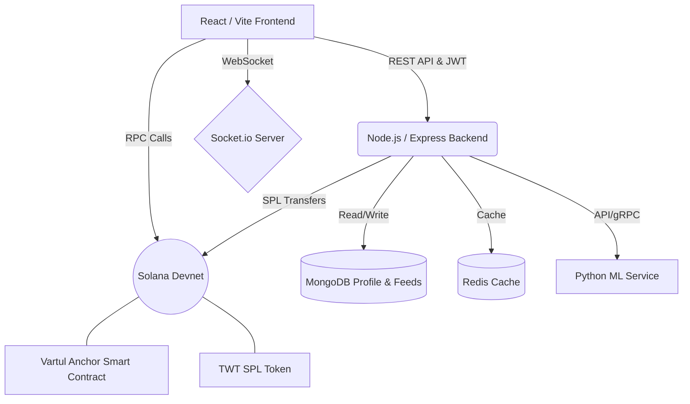

<div align="center">
  <br />
  
  <h1>✨ VarTul Engagement Platform ✨</h1>
  <p>
    <strong>A next-generation social platform combining Web3 staking with short-form media.</strong>
  </p>

  <!-- Badges -->
  <p>
    
    
    
    
  </p>
</div>

---

## 📖 Overview

**VarTul** is a full-stack Web3 social platform designed to reward creators and users for their engagement. It seamlessly blends familiar social interactions—posts, stories, short-form reels, direct messaging, and profiles—with **Solana** wallet connectivity and on-chain **engagement staking**. 

By utilizing our native **TWT (Vartul Watch Token)**, users can stake their tokens in high-yield engagement pools, earn rewards for watching reels, and interact with an ecosystem secured by blockchain mechanics and an intelligent machine-learning backend.

---

## ⚡ Key Features

📱 **Immersive Social Feed**  
Scroll through a dynamic feed of posts, stories, and short-form reels. Built for maximum engagement with smooth UI transitions and endless scrolling.

💬 **Real-Time Communication**  
Stay connected with friends using our WebSocket-powered real-time direct messaging system, complete with typing indicators, read receipts, and online presence tracking.

🔗 **Seamless Web3 Integration**  
Connect your Phantom or Backpack wallet directly. View real-time SPL token balances, manage your airdrops, and interact directly with the Solana blockchain from your dashboard.

💎 **Proof-of-Engagement Staking**  
Lock your **TWT** tokens into our custom Anchor smart contract. Earn daily yields from the creator pool by hitting engagement milestones and watching reels (Watch-to-Earn).

🤖 **Intelligent Bot Detection (ML)**  
Powered by a Python/Flask Machine Learning microservice. Protects the ecosystem by identifying and flagging unauthentic interactions, ensuring rewards go to real humans.

---

## 🛠️ Technology Stack

Discover the powerful tools bringing VarTul to life:

### **Frontend Interface**
> React 19 • Vite • Tailwind CSS 4 • Redux Toolkit
- Fully responsive, glassmorphism-inspired UI components.
- Seamless Solana wallet adapter integration (`@solana/wallet-adapter-react`).

### **Backend & APIs**
> Node.js • Express 5 • Socket.io
- Robust RESTful APIs securing user endpoints with JWT authentication.
- Real-time event handling for notifications and messaging.

### **Databases & Storage**
> MongoDB DB • Redis • Cloudinary • Pinata IPFS
- Mongoose schemas optimized for relational social data.
- Redis caching layer for high-speed retrieval of feeds.
- Decentralized media pinning via Pinata (IPFS) and fast asset delivery via Cloudinary.

### **Blockchain & Machine Learning**
> Solana • Anchor Framework (Rust) • Python (Flask)
- Custom SPL token (TWT) mint and airdrop infrastructure.
- High-performance, low-cost smart contracts deployed on Solana Devnet.
- Machine Learning pipelines for bot mitigation and feed ranking.

---

## 🏗️ Architecture & Workflow



---

## 🚀 Getting Started

Follow these steps to instantiate your local development environment.

### 📋 Prerequisites
- **Node.js**: v18+ (LTS Recommended)
- **MongoDB**: Active connection string
- **Redis**: Running local or cloud instance
- **Solana CLI & Anchor**: Only required if interacting directly with the Smart Contracts folder.

### 1️⃣ Backend Setup
```bash
cd Backend
npm install
# Ensure your .env file is configured (see Environment Variables below)
npm run dev
```
*API will start on `http://localhost:5000`.*

### 2️⃣ Machine Learning Service Setup
```bash
cd Vartul_ML
pip install -r requirements.txt
python app.py
```
*ML Service will start on `http://localhost:5001`.*

### 3️⃣ Frontend Setup
```bash
cd Frontend
npm install
npm run dev
```
*Client will start on `http://localhost:5173`.*

---

## 🌱 Environment Variables

Create a `.env` file in the `Backend/` directory with the following structure:

#### Example `Backend/.env`
```env
# Server
PORT=5000
JWT_SECRET=your_super_secret_jwt_key

# Database
MONGODB_URL=mongodb+srv://<user>:<password>@cluster.mongodb.net/
REDIS_HOST=your-redis-url
REDIS_PORT=11888
REDIS_USERNAME=default
REDIS_PASSWORD=your_redis_password

# Web3 & Solana
SOLANA_RPC=https://api.devnet.solana.com
TOKEN_MINT=your_spl_token_mint_address
TOKEN_DECIMALS=6
PLATFORM_PRIVATE_KEY=[array_of_bytes_here]
VARTUL_PROGRAM_ID=your_deployed_anchor_program_id

# Cloudinary
CLOUDINARY_CLOUD_NAME=your_name
CLOUDINARY_API_KEY=your_key
CLOUDINARY_API_SECRET=your_secret

# ML Server
ML_SERVICE_URL=http://localhost:5001
```

Create a `.env` file in the `Frontend/` directory:
#### Example `Frontend/.env`
```env
VITE_BACKEND_URL=http://localhost:5000
```
*(Do not append `/api` to the URL. The VITE application handles URL construction natively).*

---

## 🔐 Security & Operations

- **Never commit `.env` variables or wallet private keys.** Always keep them in your `.gitignore`.
- Rotate your `JWT_SECRET` routinely in production.
- Modify the CORS policy within `Backend/server.js` before deploying to a live origin to restrict unauthorized API consumption.

---

<div align="center">
  <p>Built with ❤️ by the Vartul Development Team.</p>
</div>
