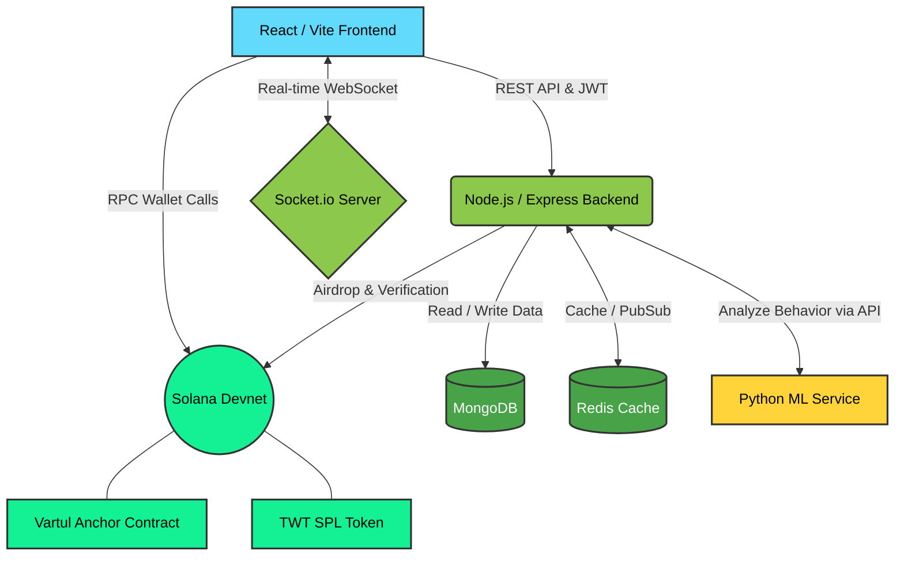

<div align="center">
  <br />
  
  <h1>✨ VarTul Engagement Platform ✨</h1>
  <p>
    <strong>A next-generation social platform combining Web3 staking with short-form media.</strong>
  </p>

  <!-- Badges -->
  <p>
    
    
    
    
    
    
  </p>
  
  <p>
    <a href="#-key-features">Features</a> •
    <a href="#-architecture--workflow">Architecture</a> •
    <a href="#-getting-started">Getting Started</a> •
    <a href="#-smart-contract-details">Smart Contracts</a> •
    <a href="#-technology-stack">Tech Stack</a>
  </p>
</div>

---

## 📖 Overview

**VarTul** is a full-stack Web3 social platform designed to reward creators and users for their true engagement. It seamlessly blends familiar social interactions—posts, stories, short-form reels, direct messaging, and profiles—with **Solana** wallet connectivity and on-chain **engagement staking**. 

By utilizing our native **TWT (Vartul Watch Token)**, users can stake their tokens into high-yield engagement pools, earn rewards for watching reels, and interact with an ecosystem secured by blockchain mechanics and an intelligent machine-learning backend.

---

## ⚡ Key Features

| Feature | Description |
| :--- | :--- |
| 📱 **Immersive Social Feed** | Scroll through a dynamic feed of posts, stories, and short-form reels. Built for maximum engagement with smooth UI transitions and endless scrolling. |
| 💬 **Real-Time Communication** | Stay connected with friends using our WebSocket-powered real-time direct messaging system, complete with typing indicators, read receipts, and online presence tracking. |
| 🔗 **Seamless Web3 Integration** | Connect your Phantom or Backpack wallet easily. View real-time SPL token balances, manage your airdrops, and execute transactions directly from your dashboard. |
| 💎 **Proof-of-Engagement** | Lock your **TWT** tokens into our custom Anchor smart contract. Earn daily yields from the creator pool by hitting engagement milestones and watching reels (Watch-to-Earn). |
| 🤖 **ML Bot Detection** | Powered by a Python/Flask Machine Learning microservice. Protects the ecosystem by identifying and flagging unauthentic bot interactions, ensuring rewards strictly go to real humans. |

---

## 🏗️ Architecture & Workflow

VarTul boasts a modern microservices-inspired architecture, separating the client interface, REST API, real-time sockets, Machine Learning pipelines, and Blockchain interactions.



---

## 🛠️ Technology Stack

Discover the powerful tools bringing VarTul to life:

<details>
<summary><b>🎨 Frontend Interface</b></summary>

- **React 19 & Vite 7**: Blazing fast modular development.
- **Tailwind CSS 4**: Modern, utility-first styling with glassmorphism UI components.
- **Redux Toolkit**: Efficient global state management.
- **Solana Wallet Adapters**: Seamless connection with Phantom, Backpack, etc.
</details>

<details>
<summary><b>⚙️ Backend & APIs</b></summary>

- **Node.js & Express 5**: Robust RESTful API architecture.
- **JWT Authentication**: Secure user session management.
- **Socket.io**: Real-time event handling for notifications and messaging.
</details>

<details>
<summary><b>🗄️ Databases & Storage</b></summary>

- **MongoDB (Mongoose)**: Document schemas optimized for relational social data.
- **Redis**: High-speed caching layer for feeds and session states.
- **Cloudinary / Pinata IPFS**: Hybrid centralized/decentralized media pinning and fast asset delivery.
</details>

<details>
<summary><b>🧠 Blockchain & Machine Learning</b></summary>

- **Solana Devnet**: High-performance, low-cost L1 infrastructure.
- **Anchor Framework (Rust)**: Secure custom smart contracts.
- **Python (Flask)**: Active bot mitigation and algorithmic feed ranking models.
</details>

---

## 🚀 Getting Started

Follow these steps to instantiate your local development environment.

### 📋 Prerequisites
- **Node.js**: v18+ (LTS Recommended)
- **MongoDB**: Active connection string
- **Redis**: Running local or cloud instance
- **Python 3.10+**: For the ML Service
- **Solana CLI & Anchor**: Only required if interacting directly with the Smart Contracts folder.

### 1️⃣ Machine Learning Service Setup
We recommend starting the ML service first.
```bash
cd Vartul_ML
pip install -r requirements.txt
python app.py
```
*ML Service will start on `http://localhost:5001`.*

### 2️⃣ Backend Setup
```bash
cd Backend
npm install
npm run dev
```
*API will start on `http://localhost:5000`.*

### 3️⃣ Frontend Setup
```bash
cd Frontend
npm install
npm run dev
```
*Client will start on `http://localhost:5173`.*

---

## 🌱 Environment Variables Configuration

Create the necessary `.env` files based on these templates:

### `Backend/.env`
```env
# Server
PORT=5000
JWT_SECRET=your_super_secret_jwt_key

# Database
MONGODB_URL=mongodb+srv://<user>:<password>@cluster.mongodb.net/
REDIS_HOST=your-redis-url
REDIS_PORT=11888
REDIS_USERNAME=default
REDIS_PASSWORD=your_redis_password

# Web3 & Solana
SOLANA_RPC=https://api.devnet.solana.com
TOKEN_MINT=your_spl_token_mint_address
TOKEN_DECIMALS=6
PLATFORM_PRIVATE_KEY=[array_of_bytes_here]
VARTUL_PROGRAM_ID=your_deployed_anchor_program_id

# Cloudinary
CLOUDINARY_CLOUD_NAME=your_name
CLOUDINARY_API_KEY=your_key
CLOUDINARY_API_SECRET=your_secret

# ML Server
ML_SERVICE_URL=http://localhost:5001
```

### `Frontend/.env`
```env
# Do not append /api to the URL.
VITE_BACKEND_URL=http://localhost:5000
```

---

## 📜 Smart Contract Details (Anchor)

The VarTul smart contract handles the core Proof-of-Engagement logic. 
Located in `SmartContracts/vartul_engagement/src/lib.rs`.

**Core Instructions:**
1. `initialize`: Sets up the global platform state on the blockchain.
2. `stake_engagement`: Allows a user to lock `TWT` tokens for a specific duration.
3. `unstake`: Releases tokens back to the user after the lock duration expires, including yielded rewards.
4. `reward_engagement`: Admin-only instruction to add TWT to the rewards pool.

To test/deploy:
```bash
cd SmartContracts/vartul_engagement
anchor build
anchor deploy --provider.cluster devnet
```

---

## 🔐 Security & Best Practices

> [!WARNING]
> **Environment Variables:** Never commit `.env` variables or wallet private keys. Keep them protected in your `.gitignore`.

> [!TIP]
> **Production Deployment:**
> - Rotate your `JWT_SECRET` routinely.
> - Modify the CORS policy within `Backend/server.js` before deploying to a live origin to restrict unauthorized API consumption.
> - Consider migrating from Devnet to Mainnet-Beta once fully audited.

---

<div align="center">
  <br />
  <p>Built with ❤️ by the VarTul Development Team</p>
  <p>
    <a href="https://solana.com/">Powered by Solana</a>
  </p>
</div>
